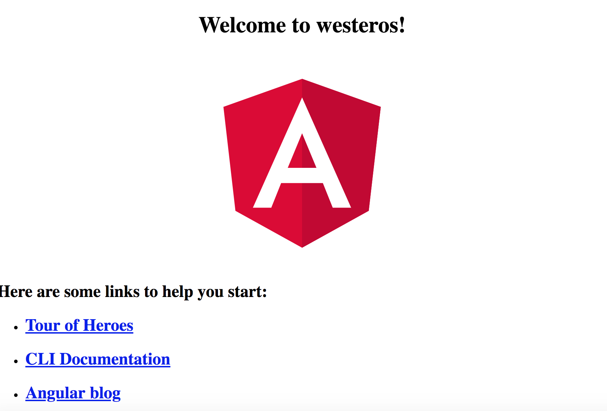
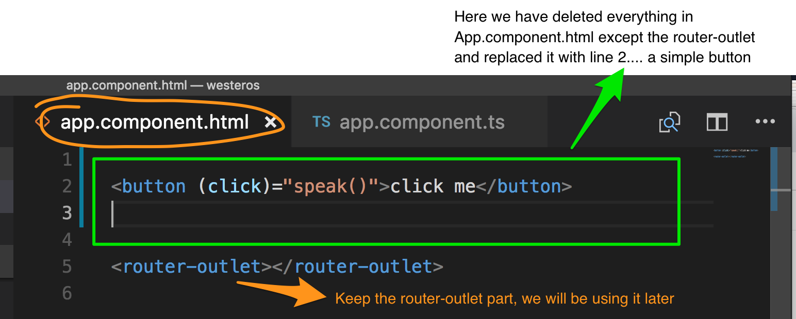
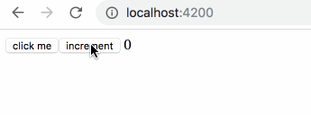

# Unit 01 :  Data flow and file structure


Notice in the above diagram, we only have one component which is rendered when the app loads.

These 4 files are all associated with that one component:

```
app.component.html
app.component.scss
app.component.spec.ts
app.component.ts

```

## Learning how click events work

Click events in Angular can be relatively simple.
We will start with the component. The component must have a method that is called when a click method occurs in the view.

Think of the component as being very similar to the part of a *class* component in React before the render method.  

You can add methods as such :



And then you can add something like this to the view to wire up a button:




In the example above, the parentheses around the (click) signify that this is an action that will travel "UP" ( or "DOWN") to the component... however you want to think about it.
In other words, the data flow is going from view to component.

In an MVC context, you can think of the component as the 'controller', and the html file as the 'view'.


Wire up your button as shown and confirm that you have a working button.  When you do, congratulations!


## Creating a counter to illustrate state and data flow

Managing state is something that we can do in React with stateful components that have constructors, etc. Here's how this works in Angular with localized state as it relates to components.

### the component


## the view:


Wire up your counter and you should have something like this:


