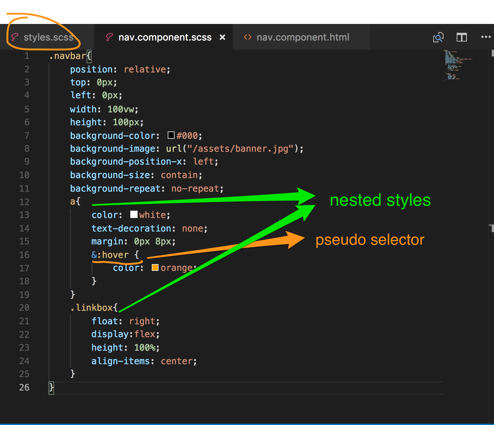
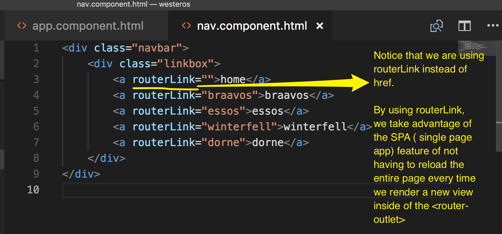

# Unit 02:  Building more pages

## Using the scaffolder to create more components

Angular has a generator that will scaffold new components for us.
We will create three new pages.  Name them whatever you'd like.

I'm going to create a navigation component, and then 4 pages for some regions in Westeros.

cd into the *app* folder, then

do either
```
ng generate component nav  
```
or
```
ng g c nav
```

(the second one is a shortcut)

now look at your folder structure:


Next, I'll create a home page:

```
ng generate component home
```


Lastly, I will generate my 4 pages:

```
ng generate component braavos  
```

```
ng generate component dorne  
```

```
ng generate component winterfell  
```

```
ng generate component essos  
```


By examining all of these generated components, you can see that they all share the same structure.

Now that we've got a ton of pages, let's go back to our app.component.html page.


## SCSS and inserting the nav component

The app.commponent.html page can be used as a container to pull in all of the other pages.
This is why it has, by default, the

```
<router-outlet></router-outlet>
 ```
tags are there.

router outlet is a component that will pull in whichever page has been served up by our router, which we will configure soon.

Since the *nav* will exist on every page, it goes directly on the app.component.html page.

When we click on a link in the nav, whichever page is clicked on should appear in the <router-outlet> component.

Let's now style the nav using SCSS , which is a modified version of SASS.
SCSS allows you to create nested styles which save time and make code more readable.

Remember that the *nav* component has it's own style sheet. One of the nice things about scaffolding Angular components is that it makes it very easy to define styles and to know where to find those styles. Everything you need for that component is in that folder.

🌺 ! TAKE HEED !  global styles that affect the entire app are located in src/styles.scss or src/styles.sass , etc.  It's called "styles" with whichever style extension you're using. Here I added the widely used margin:0 and padding:0 styles to my src/styles.css document to get everything flush to the edges of the browser.

Here is the nav style:




Ok , so now that we have style for a nav component, our nav will simply look like this:



And our *src/app/app.component.html* should look like this:


And our page should look like this:


If you want that same banner, you can get it [here](banner.jpg)

proceed to [Unit 3](../Unit03/Unit03.md), home slice ! There will will learn about how easy it is to implement routing !
