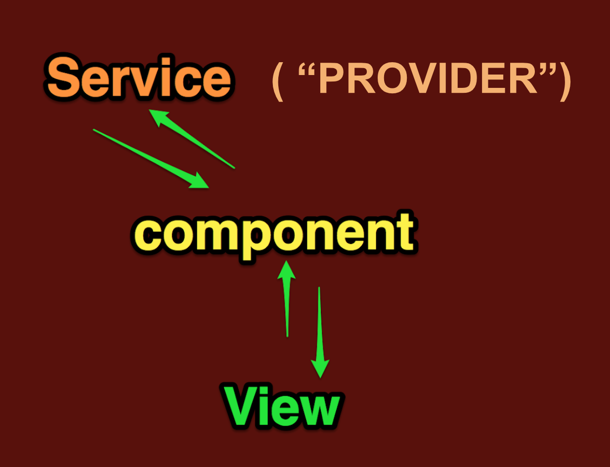
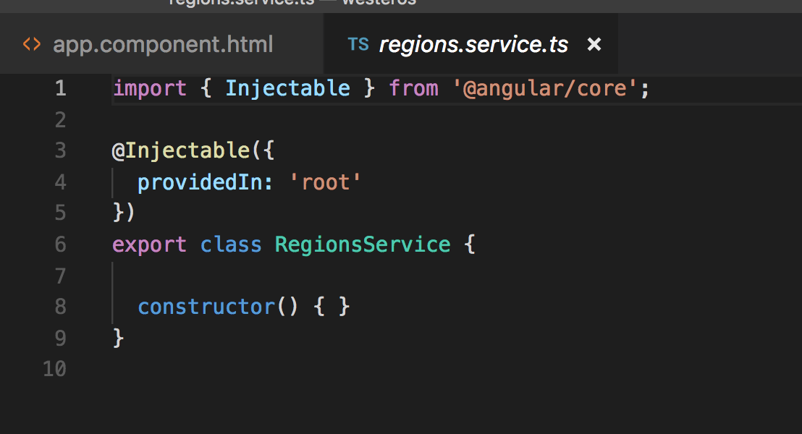

# Unit 04:  Using Services

Arguably, one of the best things about Angular are Angular services.

Services allow Angular apps to manage state while also being able to do thing like api calls to fetch data and return it to the app.

In the MVC concept, Services are almost close to being like "models". They are not really model in the pure sense , as one service can interact with several back end element. But they are "back end" workers to to speak that can interface with data and return it to our app.



Services are accessible across multiple components so they are similar to a "store" in the Redux or Mobx sense of the word. However, the setup is much less elaborate and involved that when you're using Redux.  

They are NOT an equivalent to Redux, but what's similar is their *centrality* and the fact that they are *accessible throughout the entire app* .

We can scaffold a new service using our generator:

```
ng generate service regions
```
or

```
ng g s regions
```
(shorcut syntax)

that will generate a regions service and a file to test it.
Here is the regions service fresh from the generator:





If you look closely at this service, you'll see that it's very similar to a component !

It's got many of the same elements. 
